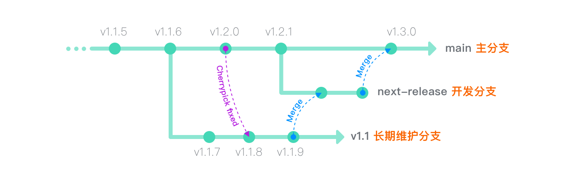

GitHub flow 是一个轻量级的，基于分支的工作流，它支持定期进行部署的团队和项目。 本指南说明了GitHub flow 的工作方式和原因。

###### 专业提示

目前 Git 是最流行的、**分布式版本控制系统**。而不是代码管理工具，更不是代码仓库那么简单！

### 创建分支

当你进行一个项目的工作时，随着项目的推进在某一时间段，你会有一些的不同的意见（features）或想法，其中一些会有用，一些会没用。分支帮你管理这些工作流。  当你创建了一个项目分支，相当于创建了一个可以尝试任何新想法的区域。在这个分支上的更改不会影响 main 分支，这样你就可以随意进行试验并且提交修改，并且不用担心你的分支会合并，直到它已经准备好了去被你的合作者去检查（review）。

###### 专业提示

分支是Git中的核心概念，整个GitHub Flow就是基于此。只有一条规矩：`main` 分支上的东西永远是可部署的。因此，在开发新功能或修订缺陷时，要从main之外创建新分支是非常重要的。你的分支名称应该是描述性的（例如：`refactor-authentication`, `user-content-cache-key`, `make-retina-avatars`），这样其他人可以看到正在做什么。

### 添加提交

创建分支后，就可以开始进行更改了。无论何时添加，编辑或删除文件，都在进行提交，并将其添加到分支中。 添加提交的过程可以跟踪您在功能分支上工作的进度。

提交还会为您的工作创建透明的历史记录，其他人可以参考该历史记录来了解您的工作以及原因。 每个提交都有一个关联的提交消息，该消息是说明为什么进行特定更改的说明。 此外，每次提交都被视为一个单独的更改单元。 如果发现错误或决定朝其他方向前进，则可以回滚更改。

###### 专业提示

提交消息很重要，尤其是因为Git会跟踪您的更改，然后将它们显示为提交后将它们显示在服务器上。 通过编写清晰的提交消息，您可以使其他人更容易跟进并提供反馈。

### 打开一个拉取请求（PR）

“拉取请求”引发有关提交的讨论。 由于它们与基础Git存储库紧密集成，因此任何人都可以确切地看到如果接受您的请求将合并哪些更改。

您可以在开发过程中的任何时候打开“拉取请求”：当您的代码很少或没有代码，但想共享一些屏幕截图或一般性想法时，遇到困难需要帮助或建议时，或者准备为某人准备时 查看您的工作。 通过在拉取请求消息中使用 GitHub 的 @mention 系统，您可以要求特定人员或团队提供反馈，无论他们是在大厅还是十个时区之外。

###### 专业提示

“拉取请求”有助于开源项目和管理共享存储库的更改。 如果您使用的是 Fork＆Pull 模型，则“拉取请求”提供了一种通知项目维护者您希望他们考虑的更改的方法。如果您使用的是共享存储库模型，则“拉取请求”可在合并到主分支之前帮助您开始代码审查和有关建议更改的对话。

### 讨论并检查您的代码

打开“拉取请求”后，审阅您的更改的人员或团队可能会有疑问或意见。 可能是编码风格与项目准则不符，更改缺少单元测试，或者看起来一切都很好并且道具井井有条。 提取请求旨在鼓励和捕获这种类型的对话。

您还可以根据有关提交的讨论和反馈继续推送到分支机构。 如果有人评论您忘记做某事，或者代码中有错误，则可以在分支机构中对其进行修复，然后进行更改。 GitHub将在统一的“拉取请求”视图中显示您的新提交以及您可能收到的任何其他反馈。

###### 专业提示

拉取请求注释是用Markdown编写的，因此您可以嵌入图像和表情符号，使用预格式化的文本块以及其他轻量级格式。

### 部署

使用 GitHub，您可以从分支进行部署，以便在合并到 main 分支之前进行的最终生产测试。

审核拉取请求并且分支通过测试后，您可以部署在生产环境中进行验证。如果分支代码引起问题，则可以通过将现有的 main 分支部署到生产中来回滚。

不同的团队可能有不同的部署策略。 对于某些人来说，最好将其部署到专门配置的测试环境中。 对于其他人，基于工作流中的其他元素，直接部署到生产环境可能是更好的选择。

### 合并

既然您的更改已在生产环境中得到验证，是时候将代码合并到 main 分支中了。

合并后，拉取请求会保留代码历史更改的记录。 因为它们是可搜索的，所以它们使任何人都能及时返回以了解做出决定的原因和方式。

###### 专业提示

通过将某些关键字合并到“拉取请求”的文本中，可以将问题与代码关联。 合并您的“拉取请求”时，也会关闭相关问题。 例如，输入短语 `Closes #32` 将关闭存储库中的问题编号32。 有关更多信息，请查看我们的 [帮助文章](https://help.github.com/articles/closing-issues-via-commit-messages)。

# 基于 Github Flow 创建过的流水线

###### 专业建议

版本号规范请查看 [SemVer 语义化版本](https://semver.org/lang/zh-CN/)

# 参考资料

- https://guides.github.com/introduction/flow/
- https://guides.github.com/pdfs/githubflow-online.pdf
- https://docs.gitlab.com/ee/university/training/gitlab_flow.html
- https://docs.gitlab.com/ee/user/markdown.html#gitlab-flavored-markdown-gfm
- https://nvie.com/posts/a-successful-git-branching-model/