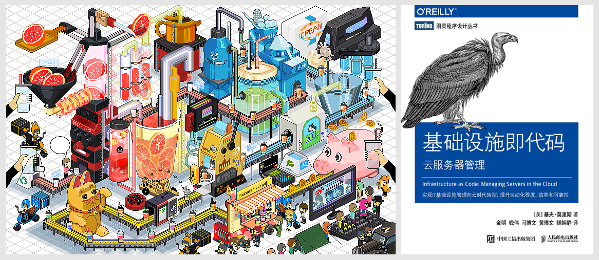
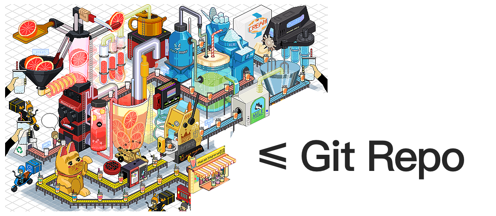

# 基础设施即代码

#### 通过“奶茶”理解基础设施即代码：

喝奶茶的用户有很多不同需求 如：口味不同、茶杯不同、温度不同、包装不同、套餐不同等。

奶茶企业并不是在做奶茶，而是在做能为客户提供 `持续制茶` 和 `持续交付` 的基础设施。目的是为客户提供 高效、低耗、灵活、准时地生产合格产品，为客户提供满意服务。

###### 举一些例子对号入座：

- 制茶设备：feature code（如：橙色的页面）
- 杯子：image code（如：docker image，可以运行在 linux docker container 中）
- 传送皮带：pipeline code（如：jekinsfile）
- 制茶设备控制器：configure code（如：nacos 配置文件）
- 测试设备：unit test/e2e test code（如：cypress，jest 代码）
- 售货车：package publish code（如：Alibaba ECS 或 Serverless）

#### 基础设施即代码有四项关键原则：

- **再生性：**环境中的任何元素可以轻松复制。
- **一致性：**无论何时，创建的环境各个元素的配置是完全相同的。
- **快速反馈：**能够频繁、容易地进行变更，并快速知道变更是否正确。
- **可见性：**所有对环境的变更应该容易理解、**可审计、受版本控制**。

#### 基础设施即代码的目标是：

- **标准化：**以代码来定义环境，实现开发环境、测试环境、生产环境的标准化。
- **自动化：**以自动化工具来驱动代码准备环境。包括创建环境、更新环境以及销毁环境。
- **可视化：**以监控来可视化环境信息。环境当前状态可视、**环境变更历史可视、可追溯**。

##### 您是什么角色，交付物到底是什么？

- 程序员：软件代码（Code）

- 开发经理：不是软件，而是基础设施（Git Repo）

# 基础设施装进 Git Repo

如果认同基础设施即代码理念，则要把基础设施以代码的形式装入 Git Repo。那以什么样的流程装入呢？

#### 先了解 Git flow

Git Flow 通常说的是 **Vincent Driessen** 在 Tuesday, January 05, 2010 写的 [A successful Git branching model](https://nvie.com/posts/a-successful-git-branching-model/) ，但是10 年后的 2020 年他在博客中留言，片段如下：

> Note of reflection (March 5, 2020) Vincent Driessen
>
> 这个模型是在 2010 年构思出来的，而现在距今已有 10 多年了，Git 本身也才诞生不久。在那10年中，git-flow（本文介绍的**分支模型**）在许多软件团队中变得非常流行，以至于人们开始将其视为某种标准，但不幸的是，它也被当作教条或灵丹妙药。
>
> ...
>
> 如果您的团队正在持续交付软件，我建议您采用更简单的**工作流程**（例如 GitHub flow），而不是尝试将git-flow引入您的团队。
>
> ...

所以您用 `敏捷开发价值观` 正在持续交付软件，建议使用 GitHub flow 把代码有效的装入 Git Repo。

请继续阅读 [Understanding the GitHub flow 中文翻译](/Understanding-the-GitHub-flow.html)

---

# 思考

基础设施即代码只是把奶茶生产流水线做出来了，它并不会自己运行制造奶茶。

- 我们可以学习 [CI/CD 关键知识](http://blog.ixiaer.com/Continuous-Integration-CI-with-GitLab.html)（只写了部分内容，持续更新）

持续运转生产流水线持续制茶和交付怎么办？客户喝了以后如何反馈？反馈后怎么优化升级生产流水线？流水线怎么监控？等等问题

- DevOps 会给我们一个满意的答案（文章暂时尚未开始写）

