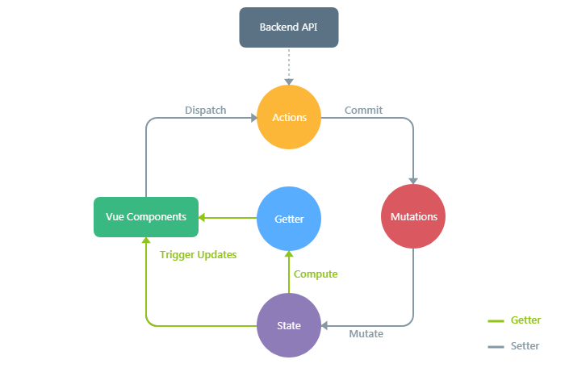
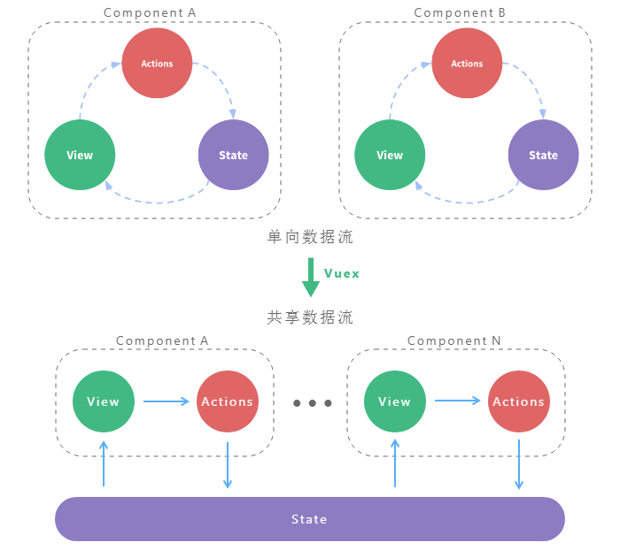
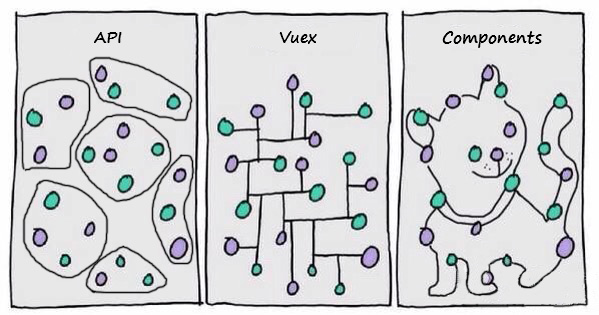
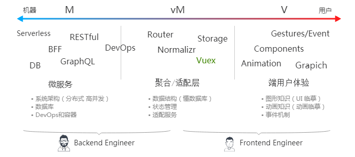

> Vuex 是一个专为 Vue.js 应用程序开发的**状态容器**，提供**可预测化的状态管理**。可以让你构建一致化的应用，运行于不同的环境（客户端、服务器、原生应用），并且易于测试和超爽的开发体验。

---
### 动机

随着应用开发日趋复杂，**JavaScript 需要管理比任何时候都要多的 状态(state)**。 这些 state 可能包括服务器响应、缓存数据、本地生成尚未持久化到服务器的数据，也包括 UI 状态，如激活的路由，被选中的标签，是否显示加载动效或者分页器等等。

管理不断变化的 state 非常困难。如果一个 model 的变化会引起另一个 model 变化，那么当 view 变化时，就可能引起对应 model 以及另一个 model 的变化，依次地，可能会引起另一个 view 的变化。直至你搞不清楚到底发生了什么。**state 在什么时候，由于什么原因，如何变化已然不受控制**。 当系统变得错综复杂的时候，想重现问题或者添加新功能就会变得举步维艰。

如果这还不够糟糕，考虑一些来自**前端开发领域的新需求**，如更新调优、服务端渲染、路由跳转前请求数据等等。

这里的复杂性很大程度上来自于：我们总是将两个对人类思维非常难以**推理**(reason)的概念：**变化**(mutation)和**异步**(asynchronicity)。 我称它们为[曼妥思和可乐](https://www.baidu.com/s?wd=曼妥思和可乐)。如果把二者分开，能做的很好，但混到一起，就变得一团糟。

```text
a = 2
a 3秒后变成 4
b 1秒后变成 a
c 2秒后变成 a + b
答案：c = 4

a = 2
a 2秒后变成 4
b 1秒后变成 a
c 3秒后变成 a + b
答案：c = 6

a = 2
a ?秒后变成 4
b ?秒后变成 a
c ?秒后变成 a + b
答案： 爆炸
```

---
### 了解 Vuex

##### 核心概念：

- **State**
  整个应用的 state 被储存在一棵 object tree 中，并且这个 object tree 只存在于唯一一个 store 中。

- **Mutation**
  **变化** store 中的 state 的唯一方法是提交 mutation。每个 mutation 都有一个字符串的 事件类型 (type) 和 一个 回调函数 (handler)。这个回调函数就是我们实际进行状态更改的地方。
  还记得**变化和异步**混在一起时会很糟糕吗，所以 Mutation **必须是同步函数**。

- **Action**
  Action 类似于 mutation，不同在于：Action 提交的是 mutation，而不是直接变更状态。Action 可以包含任意**异步**操作。

- **Getter**
  有时候我们需要从 store 中的 state 中派生出一些状态。如果有多个组件需要用到此属性，我们要么复制这个函数，或者抽取到一个共享函数然后在多处导入它——无论哪种方式都不是很理想。
  定义“getter” 就像计算属性一样，getter 的返回值会根据它的依赖被缓存起来，且只有当它的依赖值发生了改变才会被重新计算。

- **Module**
  由于使用单一状态树，应用的所有状态会集中到一个比较大的对象。当应用变得非常复杂时，store 对象就有可能变得相当臃肿。
  为了解决以上问题，Vuex 允许我们将 store 分割成模块（module）。每个模块拥有自己的 state、mutation、action、getter。

##### Vuex “工作原理” 示意图：



<a href="" target="_blank" style="flex: 1;">运行代码</a>
```javascript
new Vuex.Store({
  state: {
    age: 0
  },
  mutations: {
    UPDATE_AGE (state, newAge) {
      state.age = newAge
    }
  },
  actions: {
    updateProfile ({ commit }) {
      setTimeout(() => {
        commit('UPDATE_AGE', 18)
      }, 2000)
    }
  },
  getters: {
    stage: state => {
      return state.age < 18 ? 'minor' : 'major'
    }
  }
})

new Vue({
  template: `
    <div>
      {{ age }} years old is {{ stage }}.
    </div>
  `,
  computed: {
    age () {
      return store.state.age
    },
    stage () {
      return store.getters.stage
    }
  },
  mounted () {
    store.dispatch('updateProfile')
  }
})
```

---
### 使用 Vuex 前后对比：



##### 用代码看前后对比：

<div style="display: flex; flex-direction: row;">
  <div style="flex: 1;">
    <a href="" target="_blank">运行代码</a>
    ```javascript
    // 单项数据流
    new Vue({
      template: `
        <div>{{ age }}</div>
      `,
      data () {
        return {
          age: 0
        }
      },
      mounted () {
        this.age = 18
      }
    })
    ```
  </div>
  <div style="flex: 1;">
    <a href="" target="_blank">运行代码</a>
    ```javascript
    // 共享数据流
    new Vue({
      template: `
        <div>{{ age }}</div>
      `,
      computed: {
        age () {
          return store.state.age
        }
      },
      mounted () {
        store.commit('UPDATE_AGE', 18)
      }
    })

    new Vuex.Store({
      state: {
        age: 0
      },
      mutations: {
        UPDATE_AGE (state, newAge) {
          state.age = newAge
        }
      }
    })
    ```
  </div>
</div>

##### 单向数据流缺陷：
当我们的应用遇到**多个组件共享状态**时，**单向数据流**的简洁性很容易被破坏：

- **多个视图依赖于同一状态**。
  传参的方法对于多层嵌套的组件将会非常繁琐，并且对于兄弟组件间的状态传递无能为力。
  案例：<a href="" target="_blank">问题还原</a> | <a href="" target="_blank">传递状态</a> | <a href="" target="_blank">共享状态</a>
- **来自不同视图的行为需要变更同一状态**。
  我们经常会采用父子组件直接引用或者通过事件来变更和同步状态的多份拷贝。以上的这些模式非常脆弱，通常会导致无法维护的代码。
  案例：<a href="" target="_blank">问题还原</a> | <a href="" target="_blank">传递状态</a> | <a href="" target="_blank">共享状态</a>

---
### 范式化 State

很多时候，我们会发现接口返回的信息是如下的深层嵌套的树形结构：
```json
{
  "id": "123",
  "author": {
    "id": "1",
    "name": "Paul"
  },
  "title": "My awesome blog post",
  "comments": [
    {
      "id": "324",
      "commenter": {
        "id": "2",
        "name": "Nicole"
      }
    }
  ]
}
```
假如直接把这样的结构存储在 store 中，如果想修改某个 commenter 的信息，我们需要一层层去遍历找到这个用户的信息，同时有可能这个用户的信息出现了多次，还需要把其他地方的用户信息也进行修改，每次遍历的过程会带来额外的性能开销。

所以我们应 “**设计范式化的 State**”：
```json
{
  result: "123",
  entities: {
    "articles": {
      "123": {
        id: "123",
        author: "1",
        title: "My awesome blog post",
        comments: [ "324" ]
      }
    },
    "users": {
      "1": { "id": "1", "name": "Paul" },
      "2": { "id": "2", "name": "Nicole" }
    },
    "comments": {
      "324": { id: "324", "commenter": "2" }
    }
  }
}
```

##### 范式化工具
因为 API 经常以嵌套的形式发送返回数据，所以该数据需要在引入状态树之前转化为规范化形态。Normalizr 库可以帮助你实现这个。你可以定义 schema 的类型和关系，将 schema 和响应数据提供给 [normalizr](https://github.com/paularmstrong/normalizr#quick-start)，他会输出响应数据的**范式化**变换。输出可以放在 action 中，用于 store 的更新。

还有[Vuex-ORM](https://github.com/vuex-orm/vuex-orm) 库提供了一个非常有用的抽象层，用于管理 Vuex store 中存储的**范式化**数据。它允许你声明 Model 类并且定义他们之间的关系。然后它可以为你的数据类型生成新“表”，充当用于查找数据的特殊选择器工具，并且对数据执行不可变更新。

管理**范式化**数据通常并不是简单的增加关系而是合并(Merge)，Vue的响应试需要深拷贝才能生效 - [检测变化的注意事项](https://cn.vuejs.org/v2/guide/reactivity.html#检测变化的注意事项)：
```javascript
// 代替 `Object.assign(this.someObject, { a: 1, b: 2 })`
this.someObject = Object.assign({}, this.someObject, { a: 1, b: 2 })
```

---
### 持久化 State

说道持久化我们会经常与storage做比较：

|  | vuex | localstorage | sessionstorage | cookie |
| --- | --- | --- | --- | --- |
| **响应试** | Yes | No | No | No |
| <a href="https://ssr.vuejs.org/zh/guide/universal.html#访问特定平台-platform-specific-api" target="_blank" title="Browser & Nodejs环境下都可以运行的代码">**通用代码**</a> | Yes | No | No | No |
| **存储类型** | Object | String | String | String |
| **生命周期** | 刷新 | 持久 (*跨浏览器*) | 关闭 | 持久 |

Vuex 刷新就会从内存中清理，有时我们需要在页面重新加载时保持并重新水化您的Vuex状态，[vuex-persistedstate](https://github.com/robinvdvleuten/vuex-persistedstate) 给了我们很好的解决方案。同时 Vuex 是需要付出性能代价的，所以应按需持久化。

---
### 什么情况下我应该使用 Vuex？

Vuex 附带了更多的概念和框架，这需要对**短期和长期效益进行权衡**。如果您不打算开发中大型**单页应用(SPA)**，使用 Vuex 可能是繁琐冗余的。提升多人协作效率、长项目周期代码可维护性。却也提升了学习成本、前期项目周期等。

纯粹技术角度看所有全新的、需重构的Vue **单页应用(SPA)** 项目都应该使用它。因为 Vuex 提升小项目扩展性、大项目维护性 和 构建一致化应用的能力。更重要的是在一次一次的项目中你会学会 Vuex 背后的技术思想。所谓技术**难在思想并非编码**。

---
### Vuex 可能会改变开发模式



现在前后端分工越来越模糊，有些后端需要做的事情前端用 Nodejs 能实现，所以写 Javascript 不一定是前端开发人员。腾讯 CloudBase 团队接口用 Nodejs 实现每天10亿次访问8TB日志量，字节跳动的 “飞书” 在 electron 平台用 Nodejs 开发桌面客户端，Google 用 WebAssembly 技术 c++ 语言开发的 [Squoosh](https://squoosh.app/) 有完整的 Web UI 界面。



现在已经不能简单的用开发语言来明确 **前端** 还是 **后端**，需要 **更多的知识纬度** 会更加准确些。甚至有些时候已经分不清楚了。
